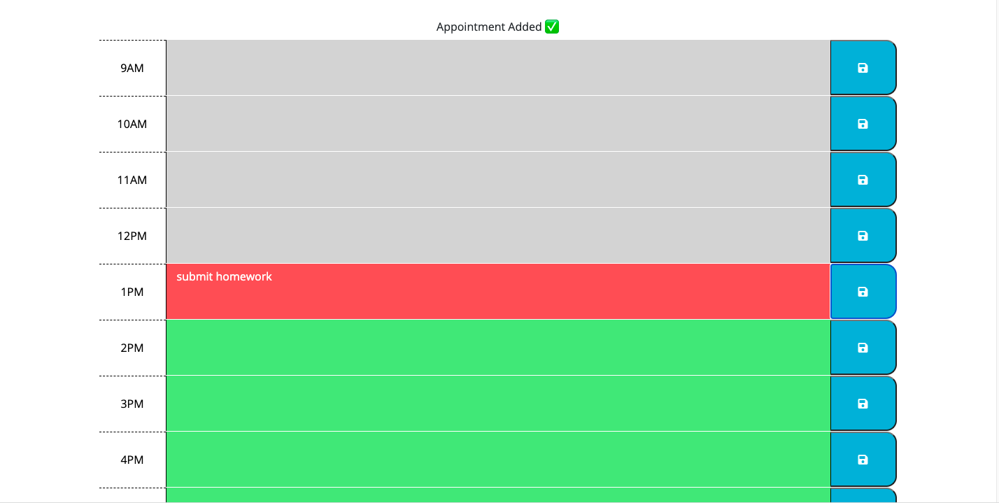

# A Breakdown of Work Day Scheduler Challenge

## Purpose of Week 5 Challenge: Third-Party APIs
This week's challenge allowed for the  use of jQuery, a Javascript library, to dynamically build a web application. For this particular web application, jQuery is used to dynamically create a work day scheduler that a user can use to schedule out day-to-day work activities. 

The web application also uses the moment library to access current date and time formatting. Here is an image of the header that contains the current date using the moment library: 

The webpage has different colored rows based on the time of the day: A row is gray if that particular hour is in the past for any given da, it is red when it is that hour of the day, and it is green when that hour is in the future for that day. When a user saves a particular row, those events are saved to local storage and a "saved message" is displayed at the top of the scheduler. 
Here is a link of the different colored rows and a "saved message" that displays when a user saves a particular event in any given row:

## Link to Password Generator Website: 
[Work Day Scheduler Website](https://savannahfausto.github.io/Work_Day_Scheduler/)